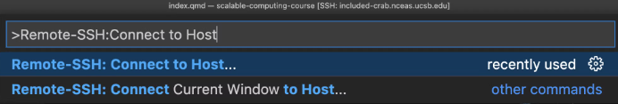
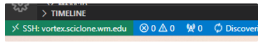

# VS Code!

# Use VS Code to access a local Python install 

# Use VS Code to access HPC

Detailed borrowed from [NCEAS’s Scalable and Reproducible Approaches to Arctic Research course](https://learning.nceas.ucsb.edu/2023-03-arctic/#setting-up) (an excellent resource!)

1. First, [download VS Code](https://code.visualstudio.com/) if you do not already have it installed. You’ll also need to download the [Remote - SSH extension](https://marketplace.visualstudio.com/items?itemName=ms-vscode-remote.vscode-remote-extensionpack).
2. To connect to the server using VS Code follow these steps, from the VS Code window, open the command pallette (Cmd + Shift + P).
3. Enter “Remote SSH: Connect to Host”



1. select “Add New Host”
2. enter the ssh command to connect to the host:

```python
ssh [wm_username]@[subcluster_name].sciclone.wm.edu
```

For example, you can do `ssh jdelvecchio01@vortex.sciclone.wm.edu` if you’re me. You’ll only have to do this step once.

1. Select the SSH config file to update with the name of the host. You should select the one in your user directory (eg: `/Users/jclark/.ssh/config`)
2. Click “Connect” in the popup in the lower right hand corner
    - Note: If the dialog box does not appear, reopen the command palette (Control+ Shift + P), type in “Remote-SSH: Connect to Host…”, choose e.g. vortex.sciclone.wm.edu from the options of configured SSH hosts, then enter your password into the dialog box that appears
3. Enter your password in the dialog box that pops up at the top of the screen. When you are connected, you will see in the lower left hand corner of the window a green bar that says “SSH: vortex.sciclone.wm.edu.”



After connecting to the server, in the extensions pane (View > Extensions) search for, and install, (1) Python, (2) Jupyter, and (3) Jupyter Keymap (note that these extensions will be installed on the server, and not locally)

## Set up conda environments on HPC

1. Add two lines to your `.bashrc` file:

```bash
source "/usr/local/anaconda3-2021.05/etc/profile.d/conda.csh"

module load anaconda3
```

1. Open a new terminal (Control + ` on Windows and then the “+” symbol on the terminal tray). Despite adding the line to the `bashrc` file (which means “run this script every time I log on to the terminal), It doesn’t seem to like `module load anaconda3` and I don’t know why. You have to do that in the terminal, I guess. So type `module load anaconda3.`  If no error message emerges, you’re good!

1. Create a test conda environment (And write `y` any time you have to install):

```python
conda create -n test python=3.10
```

1. Activate that test environment with `conda activate test`. `(test)` should now appear in front of the name of the computer you’re on.

## Build a conda environment to do a specific research task